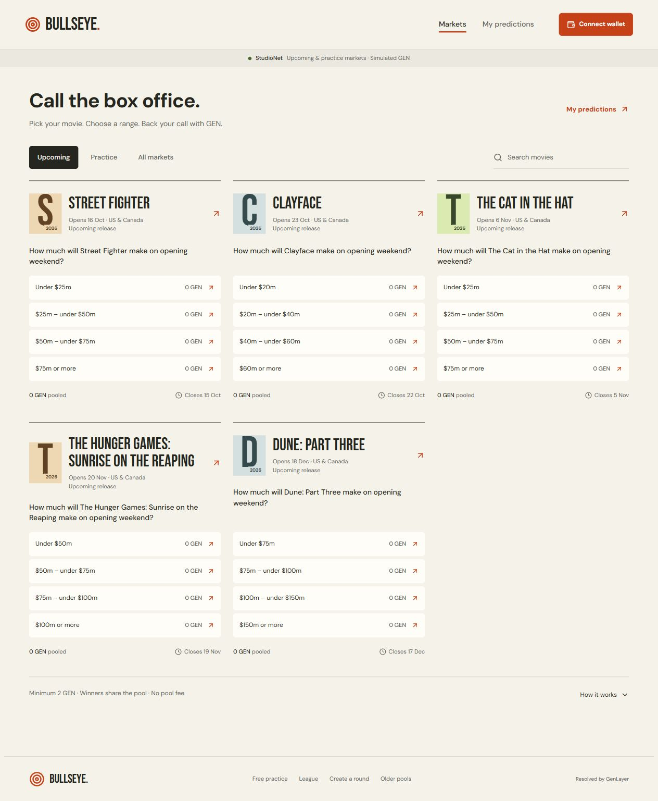

# Bullseye

A film prediction platform powered by GenLayer. Choose an opening-weekend revenue range, stake 2–100 StudioNet GEN, and collect your share of the winning pool. GenLayer validators interpret the frozen rules and independently retrieve the published result. Winners share the whole pot proportionally; no pool fee is deducted.

**[Live app](https://bullseye-genlayer.vercel.app) · [Two-minute demo](docs/DEMO.md) · [Tutorial](docs/TUTORIAL.md) · [Portal submission](docs/SUBMISSION.md) · [Verification](docs/VERIFICATION.md)**



## Use it

The default directory has five upcoming films: Street Fighter, Clayface, The Cat in the Hat, The Hunger Games: Sunrise on the Reaping and Dune: Part Three. Each has a finalized specification, one shared pool, a cutoff before previews and an unknown outcome. GEN remains held until the verified result or void. [Dates and rules](docs/UPCOMING.md).

Practice contains Barbie, Oppenheimer and Dune: Part Two. Their published results are known; the first stake opens a shared two-minute GEN session. Earlier claims remain available when a new session starts. Free points practice is a separate, wallet-free action on historical pages and `/practice`; it is excluded from competitive rankings.

Browse without a wallet. Connect MetaMask with the GenLayer wallet plugin through the header, select a range, enter at least 2 GEN and sign. The ticket and My predictions follow confirmation and settlement automatically. Collect available GEN with one signature; received status requires an exact credited native transfer. Open pages drive settlement while the daily scheduler awaits its server authentication setting.

**Network: StudioNet, chain 61999. All GEN is simulated development currency.** There is no mainnet or Bradbury deployment, real-money wagering or completed upcoming-film payout claim.

## Why GenLayer

A publisher page contains domestic, worldwide, lifetime and individual-weekend figures. A numeric parser cannot decide which number satisfies an ordinary-language film rule. Bullseye validators first independently check the proposal against the canonical specification, then independently fetch The Numbers and extract the exact number for that event. Validators also check the stored quotation against the page they read.

Deterministic code controls deadlines, units, ranges, immutable entries, specification hashes and wei-conserving payout arithmetic. Separate successful finality callbacks gate opening, results and claims. Missing evidence remains pending until the fixed deadline permits void and refunds. No administrator supplies a replacement winner. [Architecture](docs/ARCHITECTURE.md) and [evidence policy](docs/EVIDENCE.md).

## Deployed contracts and proof

| Contract | StudioNet address | Public proof |
| --- | --- | --- |
| Rule/evidence oracle | `0x756ddF8D588DA4D598F9F90947DB92Bced10D68E` | [Oracle manifest](public/protocol-proof.json) |
| Upcoming GEN pools | `0x9De7b19Cf61EDCF25d7960838D297bB51012ADA5` | [Five-market manifest](public/upcoming-pool-proof.json) |
| Historical GEN sessions | `0x6Ff023F19cE3e661A9F5Cf3e7782fec17f067Ed2` | [Film manifest](public/film-pool-proof.json) |

The historical proof retains successful specifications, validator-fetched results, finalized callbacks, and a signed 2 GEN stake plus credited 2 GEN payout for each film using one entrant. Upcoming proof retains five finalized open specifications and pools with no predetermined outcomes. Raw receipts include failed or pending attempts rather than concealing them. [Proof limits](docs/VERIFICATION.md).

## Run locally

Node 22+ (tested 24.12); Python 3.14 for contract tests. SDK dependencies and the concrete GenVM runner are pinned.

```powershell
git clone https://github.com/JWattjr/Bullseye.git
cd Bullseye
npm ci
Copy-Item .env.example .env.local
npm run dev
```

Open http://localhost:3100. No operator signing key is needed by the app. Hosted practice, drafts and receipt caches use browser storage; clearing site data removes local practice. Authoritative GEN positions remain public finalized contract state. The alternative local `.data` file store supports one process only and must not be deployed to an ephemeral serverless filesystem.

## Verify

```powershell
npm test
npm run lint
npm run typecheck
npm run build
python -m pip install -r requirements.txt
python -m pytest tests/direct -q
genvm-lint check contracts/bullseye.py
genvm-lint check contracts/forecast_pools.py
npm run test:network
npx tsx scripts/verify-upcoming.ts
```

Start the app before browser checks. Set `BULLSEYE_URL` to another origin. `npm run test:browser` covers keyboard interaction, practice scoring, persistence, evidence, drafts, synthetic rehearsal and error recovery. `npx tsx scripts/consumer-check.ts` covers the consumer wallet flow using isolated fixtures without broadcasts. Set `BULLSEYE_VERIFY_FILMS=yes` for `npx tsx scripts/movie-stakes-check.ts` to check all eight tickets using actual finalized network reads. Browser scripts use installed Playwright Chromium; see [tutorial setup](docs/TUTORIAL.md).

Latest release verification: **77 contract tests, 23 application tests**, lint, strict TypeScript, production build, published desktop/mobile consumer checks and actual finalized reads. Mock two-wallet collection is identified separately from signed single-entrant network proof.

## Scope

Owner-only oracle creators; one metric and publisher; 200 entrants per market; browser-local practice; StudioNet availability/rate limits; no permanent full-page archive; no automatic retry of failed native transfers. First verified results ignore later source corrections. Upcoming release changes never silently rewrite the frozen weekend. The background keeper is implemented but inactive pending its secret; open-page settlement works. See [deployment](docs/DEPLOYMENT.md) and [pool behavior](docs/POOLS.md).

Code and original typographic art are MIT licensed; font licenses remain in their packages. Film titles identify events. No studio posters or stills are shipped. No Portal contribution has been posted and no reward or eligibility is promised.
