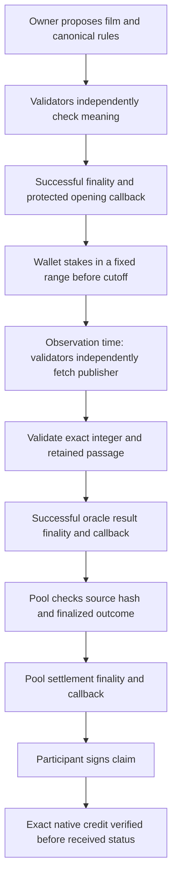

# Authority and settlement

The film oracle interprets rules and evidence; GEN pool contracts use that finalized result. The frontend owns the consumer flow and observes public state. It cannot set winners or authorize payouts.

Missing/unsuitable evidence remains pending until the frozen deadline, then permits void. A finalized void source or empty winning range refunds original entries. Source corrections after the first verified result are ignored. No administrator-entered result or source substitution exists.

## Contracts

**Bullseye v2 oracle** (`contracts/bullseye.py`) owns canonical specification checks, creator authorization, interpreted validity and extraction, exact amount normalization, interval arithmetic, evidence hashes and protected finality callbacks. Free league points derive from confirmed competitive oracle entries and resolved results; no mutable award counter can be duplicated by retries.

Both non-deterministic paths rerun substantive interpretation. Specification decisions must match. Evidence decisions match on bounded status and normalized value, and each validator verifies the leader's retained passage on the page it fetched. Execution errors never receive automatic validator agreement.

**Forecast pools** (`contracts/forecast_pools.py`) run only on StudioNet 61999. Each upcoming film has one shared pool bound to a competitive finalized open source and its specification hash. One immutable 2–100 GEN entry per wallet; fixed pre-release cutoff; no rollover. Claims await source and pool finality. Proportional cumulative integer allocation conserves the entire pot including wei dust.

**Historical sessions** (`contracts/film_pools.py`) consume already resolved sources. The first payable entry creates a shared two-minute pool atomically; later sessions preserve old claims. Known historical results are visible before entry and excluded from competitive forecasting claims.

## Client and server

Public RPC reads use pinned genlayer-js 1.1.8 and `TransactionHashVariant.LATEST_FINAL`. Successful execution and separate callback receipts matter in addition to lifecycle status. Stakes/claims are signed directly by the browser wallet. No operator key or custodial signing relay exists in Next.js.

The server can submit permissionless zero-value adjudication, void, settlement and claim verification from disposable unfunded StudioNet accounts. It accepts only listed movies and bound pool IDs; it cannot supply a result, stake or claim. Open-page polling drives this today. The daily keeper is implemented with a fixed market list, callback waits, per-film failure isolation, earlier-session pagination and a time budget. Production authentication is pending CRON_SECRET; an unset or wrong bearer token returns 401.

Both pool contracts reserve `claim(poolId, attempt)` before emitting a transfer. Permissionless `verify_claim` independently fetches the exact finalized parent and native child from the fixed Studio RPC through strict equality consensus. The pool ID, attempt nonce, sender, recipient and amount must match. A protected finality callback records paid only for explicit native credit, or failed for explicit terminal non-credit. Only failed attempts permit a new nonce; retry requires backing for all unpaid obligations. The app requests zero-value verification automatically and shows Retry collection after failure finality. [Recovery state machine and proof](CLAIM-RECOVERY.md).

## Persistence and limitations

Hosted browser storage contains guest practice, drafts and public receipt projections, keyed appropriately by wallet. It cannot authorize contract entries or payouts. Wallet-selected watch views are public projections, not authentication to private data. Alternatively, a local single-process serialized file database uses an HttpOnly guest cookie; this is unsuitable for an ephemeral or multi-process deployment.

The publisher controls source facts and availability. Retained passage hashes prove integrity of an excerpt, not permanent whole-page retention or factual truth. Only The Numbers and domestic opening-weekend revenue are supported. Creator authorization remains owner-only; pools cap 200 entrants and 2000 pool records. StudioNet is a development simulator; broader shared-testnet deployment, durable indexing and production monitoring remain later work.
