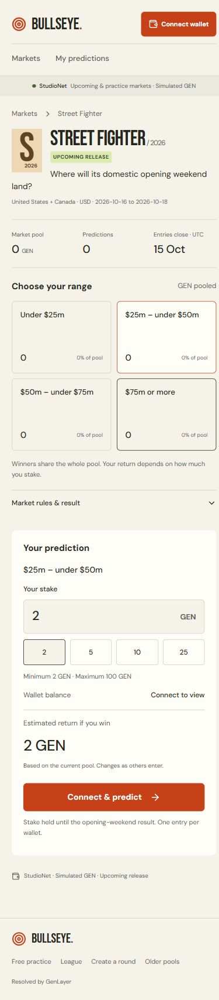

# Reviewer walkthrough

Live: [Bullseye](https://bullseye-genlayer.vercel.app). Source: [JWattjr/Bullseye](https://github.com/JWattjr/Bullseye). **StudioNet, chain 61999; GEN is simulated development currency.**

## Two-minute review, no funds required

| Time | Action | Evidence |
| --- | --- | --- |
| 0:00–0:20 | Open [Markets](https://bullseye-genlayer.vercel.app/pools). Browse Upcoming, search Dune, then clear. | Five films, ranges, release/cutoff dates and actual stake totals. |
| 0:20–0:45 | Open [Street Fighter with a selected range](https://bullseye-genlayer.vercel.app/rounds/street-fighter-2026?range=1#prediction). Inspect the 2 GEN ticket and expand Market rules & result. | One ticket, presets, pool-based estimate, fixed deadlines, unknown result. No signing required. |
| 0:45–1:10 | Choose Practice; open Barbie and expand Play for free points. Select $150m – under $200m and confirm without an exact guess. Reload. | Instant 100 practice points for $162,022,044, preserved after reload. This does not stake GEN. |
| 1:10–1:35 | Expand settlement rules and Evidence & technical record. Inspect the publisher and [oracle proof](https://bullseye-genlayer.vercel.app/protocol-proof.json). | Frozen event, exact value, passage and successful finalized adjudication/callbacks. |
| 1:35–2:00 | Inspect [historical film proof](https://bullseye-genlayer.vercel.app/film-pool-proof.json) and [upcoming proof](https://bullseye-genlayer.vercel.app/upcoming-pool-proof.json). Open My predictions. | Signed historical deposits/payouts, five open finalized sources/pools, wallet-specific portfolio. |

The main GEN ticket and secondary free-points form are separate actions. Historical results are visible before staking. Do not describe practice confirmation as a funded transaction.

## Optional live GEN demo by the wallet owner

Use the connected StudioNet wallet with at least 2 GEN. The built-in faucet in [Studio](https://studio.genlayer.com) must fund that same account; [network instructions](https://docs.genlayer.com/developers/networks) explain it. Studio and browser wallet accounts can differ.

1. Connect through the header. Choose **$150m – under $200m** in Barbie's main ticket.
2. Keep **2 GEN**, click Predict with 2 GEN, and sign in your wallet. First entry starts a shared two-minute session; an existing session uses its remaining time.
3. Open My predictions and leave a page open while the daily scheduler is inactive. Confirmation and finalized settlement update automatically.
4. Use Collect and sign once. Wait for GEN received in your wallet and a balance update. The amount depends on entries; do not promise a fixed return.

An upcoming film cannot demonstrate a quick payout: funds stay held until its future result or void. This optional flow spends development tokens and is performed by their owner. The submission does not require another broadcast.

## Independently checkable proof

- Oracle `0x756ddF8D588DA4D598F9F90947DB92Bced10D68E`: rule interpretation and publisher extraction.
- Historical pools `0xD12AaAf442A01708f4DF0C5eb0B3171C3cAb9403`: new 2 GEN Barbie deposit, exact credited payout and independently finalized paid state. Prior three-film receipts remain in the linked legacy manifest.
- Forecast pools `0xBC8b76e39B6364E16E85F5881ccC0ece5ddb9a25`: five bound open pools without predetermined winners.
- [Upcoming verification](proofs/upcoming/network-verification.json), [raw film receipts](proofs/films), [verification matrix](VERIFICATION.md).

The isolated consumer fixture demonstrates two-wallet allocation and collection without broadcasts. No live two-wallet proof, production-chain deployment or completed upcoming payout is claimed.

## Submission images

Unedited published-app captures; these are not wallet-transaction recordings:

Recorded owner demo: https://youtu.be/IUI4EQOu00M. The October 9 recovery correction is documented separately in [CLAIM-RECOVERY.md](CLAIM-RECOVERY.md); the existing video does not establish that later failure test. Run the read-only recovery verifier and the controlled browser test linked there.
